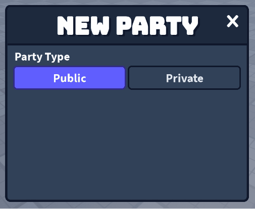
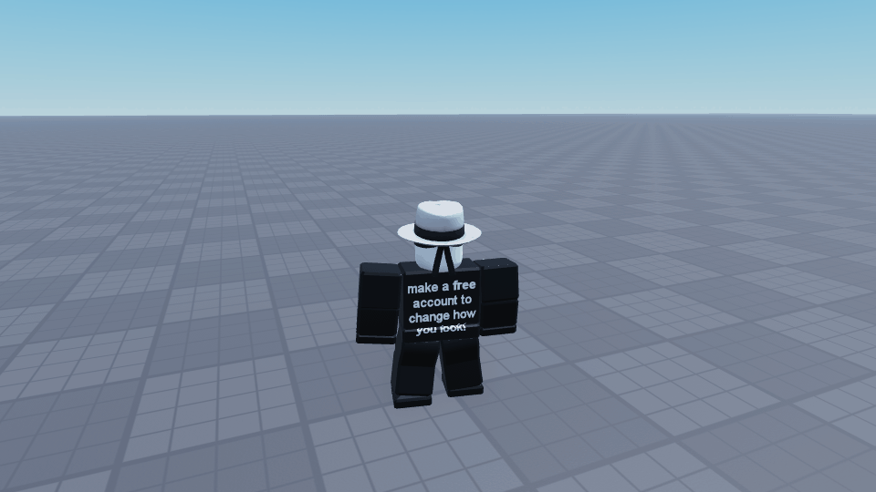

# GUI Components

A collection of Roblox GUI components.

## Table of Contents

- [How to Use](#how-to-use)
- [Available Components](#available-components)
  - [Radio Group](#radio-group)
  - [Modal](#modal)

## How to Use

To use a component, place its `ModuleScript` into your game (e.g., inside `ReplicatedStorage`) and `require` it from a `LocalScript`.

All components follow a similar constructor pattern:

```lua
local ReplicatedStorage = game:GetService("ReplicatedStorage")
local MyComponent = require(ReplicatedStorage:WaitForChild("MyComponent"))

local newComponent = MyComponent.New(...)
```

## Available Components

### Radio Group

Creates a group of selectable GUI buttons, allowing the user to select one.

### Example:

```lua
local ReplicatedStorage = game:GetService("ReplicatedStorage")
local Components = ReplicatedStorage:WaitForChild("Components")

local RadioGroup = require(Components:WaitForChild("RadioGroup"))

local radioFrame = script.Parent
local radioButtons = {radioFrame.PublicButton, radioFrame.PrivateButton}

local function selectFunction(button: TextButton)
	local uiStroke = button:FindFirstChildOfClass("UIStroke")
	button.BackgroundColor3 = Color3.fromHex("#615fff")
	button.BackgroundTransparency = 0
	button.TextColor3 = Color3.fromHex("#ffffff")
	uiStroke.Color = Color3.fromHex("#312c85")
end

local function deselectFunction(button: TextButton)
	local uiStroke = button:FindFirstChildOfClass("UIStroke")
	button.BackgroundTransparency = 1
	button.TextColor3 = Color3.fromHex("#e2e8f0")
	uiStroke.Color = Color3.fromHex("#0f172b")
end

-- Create a new RadioGroup with given buttons, and appearance functions
local partyTypeRadio = RadioGroup.New(
	radioButtons,    -- The radio group buttons
	radioButtons[1], -- The default selected button
	selectFunction,  -- Function to set selected appearance of radio button
	deselectFunction -- Function to set deselected appearance of radio button
)
-- Access the currently selected button
local selected = partyTypeRadio.Selected
```



**Note:** When a new `RadioGroup` is created, the deselect function is run on each of the given buttons to normalize them.

### Modal

Creates a pop-up GUI element, from an existing `GuiObject`, that tweens into view while blurring the background.

### Example:

```lua
local ReplicatedStorage = game:GetService("ReplicatedStorage")
local Components = ReplicatedStorage:WaitForChild("Components")

local Modal = require(Components:WaitForChild("Modal"))

local playFrame = script.Parent.PlayFrame
local playFrameCloseButton = playFrame.CloseButton

-- Create a new modal instance with 0.15s animation time, 24 background blur,
-- and closed by default, that can be toggled by pressing "P".
local myModal = Modal.New(
    playFrame,           -- The GuiObject to act as the modal
    TweenInfo.new(0.15), -- (Optional) The TweenInfo for the modal animation
    24,                  -- (Optional) The background blur intensity
    false                -- (Optional) Whether the modal starts open
)
-- (Optional) Connect GUIButtons to open, close, or toggle the modal
-- myModal:SetButtons(<openButton>, <closeButton>, <toggleButton>)
myModal:SetButtons(nil, playFrameCloseButton, nil)
-- (Optional) Bind user input type(s) to togle the modal
myModal:SetContext({Enum.KeyCode.P})
```



**Note:** Creating a new `Modal` instance parents the given `GuiObject` to a `CanvasGroup`, changing its hierarchy. Be mindful of this when referencing it later.
